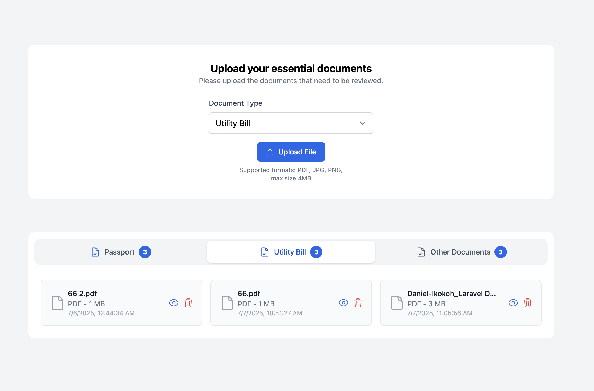

# VISA Dossier Upload Feature

A simplified VISA Dossier management system using Laravel (API-only) for the backend and React Router for the frontend.
### Link
-[Live Demo](https://dossier-fr.vercel.app/)
## Screenshot

## Documentation

## Project Structure

- `backend/`: Laravel API for file management
- `frontend/`: React application for the user interface

## Features

- Upload files (PDF, PNG, JPG) up to 4MB
- List uploaded files grouped by type (Passport, Utility Bill, Other)
- Delete files
- Preview uploaded files
- Responsive UI with visual feedback

## Backend Setup

### Prerequisites

- PHP 8.1 or higher
- Composer
- SQLite (for development)

### Installation

1. Navigate to the backend directory:

```bash
cd backend
```

2. Install dependencies:

```bash
composer install
```

3. Create environment file:

```bash
cp .env.example .env
```

4. Generate application key:

```bash
php artisan key:generate
```

5. Create SQLite database:

```bash
touch database/database.sqlite
```

6. Run migrations:

```bash
php artisan migrate
```

7. Create storage link:

```bash
php artisan storage:link
```

### Running the Backend

Start the Laravel development server:

```bash
php artisan serve
```

The API will be available at http://localhost:8000.

### API Endpoints

- `GET /api/dossier-files`: List all files grouped by type
- `POST /api/dossier-files`: Upload a new file
- `DELETE /api/dossier-files/{id}`: Delete a file

## Frontend Setup

### Prerequisites

- Node.js 16 or higher
- npm 

### Installation

1. Navigate to the frontend directory:

```bash
cd frontend
```

2. Install dependencies:

```bash
npm install
```

3. Create environment file:

```bash
mkdir .env
```

4. Add Api base url

```
VITE_BASE_URL= "http://127.0.0.1:8000/api"
```

### Running the Frontend

Start the React development server:

```bash
npm run dev
```

The application will be available at http://localhost:5173/.

## Testing

### Backend Tests

The backend includes comprehensive tests:

- Unit tests for models and services
- Feature tests for API endpoints
- Integration tests for complete workflows

Run the tests:

```bash
cd backend
php artisan test
```
